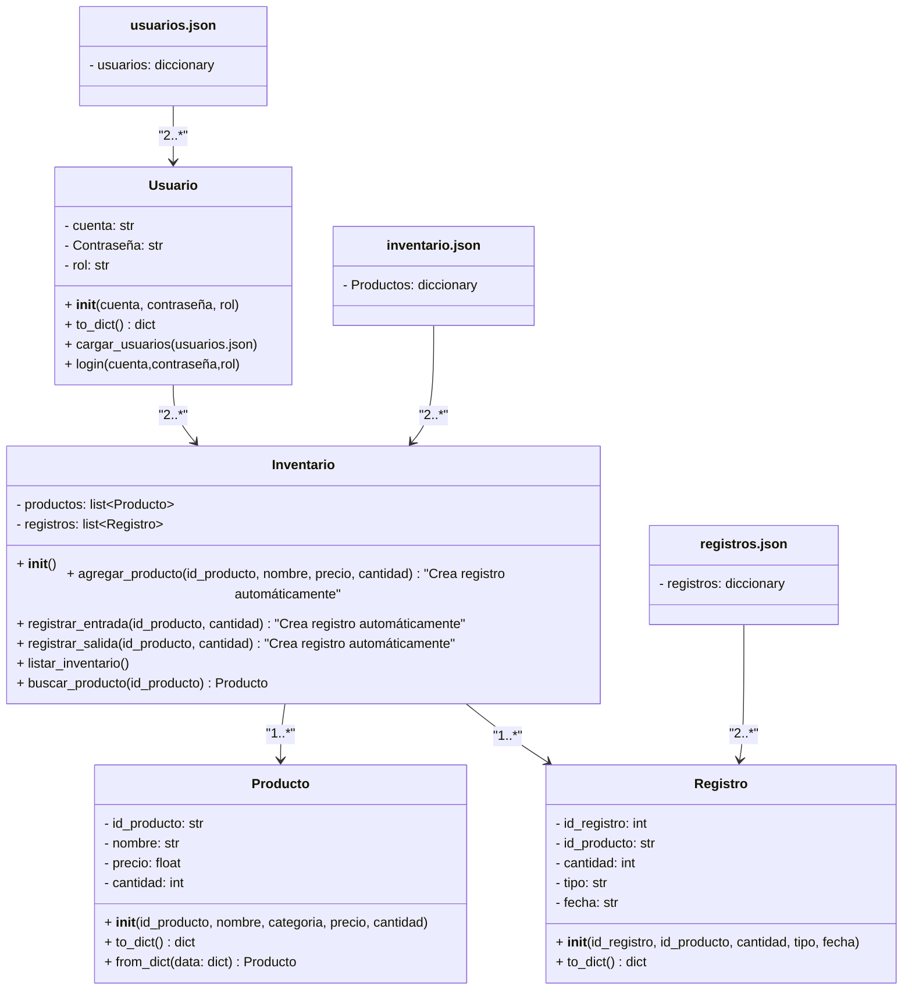

# UNIVERSIDAD NACIONAL DE COLOMBIA
# Programación Orientada a Objetos 2024-II

> Sistema de gestión de inventario para una tienda de productos y componentes electrónicos.

# 🚀 Funcionalidades propuestas
- ✅ Carga masiva de datos desde una base .json
- ✅ Mostrar el inventario actualizado en cualquier momento
- ✅ Login de usuarios protegido por contraseña
- ✅ Consulta detallada de cada operación (fecha, hora, usuario)
- ✅ Interfaz simple para navegar las distintas opciones

## 🏗 Fase 1
En la primera parte nos enfocamos en poner en marcha las funciones básicas:
- Manejo de inventario
- Estructuramiento de objetos
- Base de productos y funcionamiento

### :card_file_box: Diagrama UML fase 1

```mermaid
classDiagram
    class Producto {
        - id_producto: str
        - nombre: str
        - precio: float
        - cantidad: int
        + __init__(id_producto, nombre, categoria, precio, cantidad)
        + to_dict() dict
        + from_dict(data: dict) Producto
    }

    class Registro {
        - id_registro: int
        - id_producto: str
        - cantidad: int
        - tipo: str
        - fecha: str
        + __init__(id_registro, id_producto, cantidad, tipo, fecha)
        + to_dict() dict
    }

    class Inventario {
        - productos: list~Producto~
        - registros: list~Registro~
        + __init__()
        + agregar_producto(id_producto, nombre, precio, cantidad) "Crea registro automáticamente"
        + registrar_entrada(id_producto, cantidad)  "Crea registro automáticamente"
        + registrar_salida(id_producto, cantidad)  "Crea registro automáticamente"
        + listar_inventario()
        + buscar_producto(id_producto) Producto
    }

    Inventario --> Producto : 
    Inventario --> Registro : 
```

### 🛠 Estructura de archivos fase 1

```plaintext
📦 StockMaster/
|── 📌 main.py                    # Punto de entrada del programa
|
│── 📂 models/                    # Clases principales del proyecto
|  |── 📌 product.py              # Clase Producto: representa los productos del inventario
|  |── 📌 records.py              # Clase Registro: representa los movimientos (entradas/salidas)
|
│── 📂 services/                  # Lógica de negocio
|  |── 📌 inventory_service.py    # Manejo de inventario, registros y persistencia
```

### :sparkles: Resultados fase 1
Podemos observar una interfaz rudimentaria de interacción con el usuario
```python
StockMaster
1. Add product
2. Show products
3. Search product
4. Change stock
5. Update product
6. Delete product
7. Exit
Select an option: 1
Enter product id: 12
Enter product name: charger
Enter product price: 123
Enter product stock: 7
Product added successfully
```
ahora exploramos la muestra de elementos
```python
tockMaster
1. Add product
2. Show products
3. Search product
4. Change stock
5. Update product
6. Delete product
7. Exit
Select an option: 2
Products in inventory
Id:12 - Name:charger - Price: 123.0 - Stock: 7
StockMaster
1. Add product
2. Show products
3. Search product
4. Change stock
5. Update product
6. Delete product
7. Exit
Select an option:            
```
como se puede apreciar el elemento nuevo fue creado con éxito 
# :construction: Fase 2
Para la segunda fase, comenzamos por agregar el sistema de autenticación con contraseña.
Adicional a esto hemos ejecutado el almacenamiento de elementos en formatos json asi mismo como su modificación.

Igualmente se crea la interfaz de usuario para navegar a través de las funcionalidades previas.
### :card_file_box: Diagrama UML fase 2


### 🛠 Estructura de archivos fase 2
```plaintext
📦 StockMaster/
|── 📌 main.py                    # Punto de entrada del programa
|
│── 📂 models/                    # Clases principales del proyecto
|  |── 📌 product.py              # Clase Producto: representa los productos del inventario
|  |── 📌 records.py              # Clase Registro: representa los movimientos (entradas/salidas)
|  |── 📌 Users.py                # Clase Registro: representa los movimientos (entradas/salidas)
|
│── 📂 services/                  # Lógica de negocio
|  |── 📌 inventory_service.py    # Manejo de inventario, registros y persistencia
│── 📄 inventory.json             # Archivo para almacenar los datos de los productos
│── 📄 records.json               # Archivo para almacenar los movimientos de inventario
│── 📄 usuarios.json              # Archivo para almacenar los usuarios registrados con sus contraseñas

```
### 💡 Ejemplo
La primera interacción con el usuario es el ingreso al sistema:
```python
Welcome to StockMaster
Please login
Name: Juanito Perez
Password: 1144
Role: employee
Cuenta no existente.
```
Juanito Perez no es un trabajador de la empresa ni está registrado en el sistema

```python
Welcome to StockMaster
Please login
Name: Felipe Gonzalez
Password: 0000
Role: Employee
Información inválida. Por favor, verifique.
```
Felipe Gonzalez está en el sistema pero su ingreso no correponde con los datos regitrados en la base de seguridad.
```python
Welcome to StockMaster
Please login
Name: Felipe Gonzalez
Password: 0000
Role: Boss
Login exitoso

Welcome to our system. Select an option:
1. Add product
2. Show products
3. Search product
4. Change stock
5. Update product
6. Delete product
7. Exit
Select an option: 1
Enter product id: 1000
Enter product name: Digital Camera
Enter product price: 2800
Enter product stock: 3
Product added successfully
Welcome to StockMaster
Please login
Name:

```
La información coincide con la base de datos de seguridad y el jefe pudo ingresar al sistema. Allí logra entrar a lo que se evidenció en la fase 1.

registros en los json
inventario.json
```python
{
    "Productos": [
        {
            "id": 1,
            "name": "Laptop",
            "price": 1200,
            "stock": 5
        },
        {
            "id": 2,
            "name": "Smartphone",
            "price": 800,
            "stock": 10
        },
        {
            "id": 3,
            "name": "Tablet",
            "price": 450,
            "stock": 8
        },
...
        {
            "id": 23,
            "name": "Headphones",
            "price": 250,
            "stock": 15
        }
    ]
}
```
usuarios.json
```python
{
    "Usuarios": [
        {
            "account": "Felipe Gonzalez",
            "Password": "0000",
            "role": "Boss"
        },
        {
            "account": "Santiago Daza",
            "Password": "0001",
            "role": "Administrative"
        },
        {
            "account": "Julian Torres",
            "Password": "0002",
            "role": "employee"
        },
        {
            "account": "Ana Amaya",
            "Password": "0003",
            "role": "employee"
        }
        
    ]
}
```
registros.json
Cabe resaltar que este se actualiza según las acciones hechas en el sistema
```python
{
    "Registros": [
        {
            "Record_id": 1,
            "Product_id": 64,
            "Amount": 1,
            "Movement": "add",
            "Date": "2025-01-29"
        },
        {
            "Record_id": 2,
            "Product_id": 24,
            "Amount": 1,
            "Movement": "removed",
            "Date": "2025-01-29"
        },
        {
            "Record_id": 3,
            "Product_id": 28,
            "Amount": 1,
            "Movement": "removed",
            "Date": "2025-01-29"
        },
        {
            "Record_id": 4,
            "Product_id": 64,
            "Amount": 1,
            "Movement": "removed",
            "Date": "2025-01-29"
        }
    ]
}
```

### 🌟 Integrantes  
- 📱 Amaya Gómez Ana María
- 🏭 Daza Yepes Santiago
- 🤖 Torres Zaque Julian Ricardo


---

